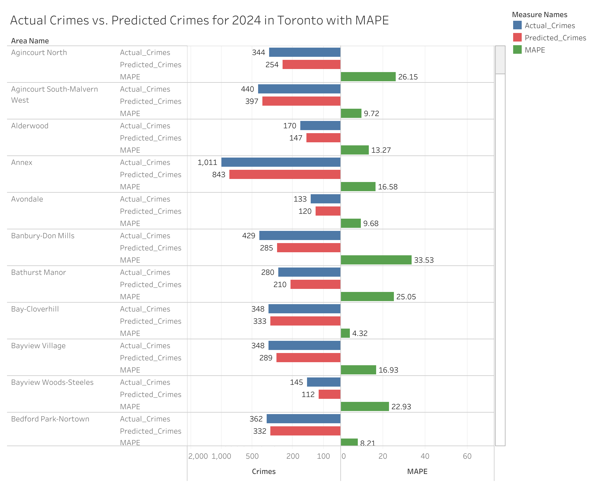

- [Purpose and Overview](#purpose-and-overview)
- [Methodology](#methodology)
- [Project Scope](#project-scope)
- [Data Cleaning](#data-cleaning)
- [Analysis](#analysis)
- [Visualization](#visualization)
- [Conclusion](#conclusion)
- [Credits and Source](#credits-and-source)

# Purpose and Overview

This project performs a comprehensive analysis of historic neighborhood crime rates in Toronto spanning from 2014 to 2024. Using this data, the analysis forecasts the total crime volume for 2025, with separate, granular forecasts provided for each neighbourhood.

The core objective is to provide a deeper understanding of crime volume trends over time, offering actionable insights into both past patterns and future projections. The resulting data and forecasts are intended to support communities, connected departments and police forces in making data-driven operational decisions and implementing targeted, necessary resource allocations and strategic changes.

# Methodology

## Steps taken:

1. Data Cleaning: Handling missing values, removing inconsistencies, and ensuring data readiness.
2. Preliminary analysis to identify correlation: Understanding patterns, correlations, and data distribution.
3. Forcasting model: applying ARIMA model to determine crime volume in Toronto in 2025 in total and per each neighbourhood. Additionally, creating training and test sets and assessing model accuracy.
4. Visualization: Creating plots using python and Tableau to represent insights and model results.
5. Conclusion.

## Technical Stack:

### Programming Language:

Python

### Libraries Used:

Numpy: matrix operations
Pandas: data analysis
Matplotlib: creating graphs and plots
Plotly: creating graphs and plots
Seaborn: enhancing matplotlib plots
Pmdarima: ARIMA model for predicting analysis

### Other tools:

Tableau

# Project Scope

The scope of this comprehensive analysis includes the following components:
- **Neighbourhood Trends:** Defining the crime volume trend over the eleven years (2014-2024) within the top 3 most active neighbourhoods for each crime type.
- **Area Ranking:** Identifying and ranking the top 10 neighbourhoods with the highest total volume of crime across all types throughout the entire 11-year dataset.
- **Total Forecast:** Generating a prediction for the total crime volume for the year 2025 across all of Toronto.
- **Granular Forecast:** Generating separate, individualized forecasts for the expected crime volume trend in 2025 for each neighbourhood.

## Description

This project begins with a pre-analysis of historical crime volume data in Toronto spanning 2014 to 2024, which reveals the crime trend across individual neighbourhoods. Using the optimized ARIMA modelling approach, the analysis provides forward-looking predictions for the crime volume trend in 2025, specifically forecasting total volume trends for each major crime type and neighbourhood-level trends.

Model reliability is ensured through rigorous data splitting and the application of industry-standard performance metrics (such as MAE, RMSE, and MAPE) for validation. The output of this analysis is a set of validated forecasts, accompanied by strategic insights and actionable recommendations for all relevant stakeholders.
## Stakeholders

### Government and Law Enforcement:
- **Toronto Police Service** - directing patrol resources, justifying budget requests for specific units (e.g., gun violence or organized crime), planning targeted intervention programs, and setting operational priorities for the year.
- **Toronto City Council** - evaluating the success of current public safety initiatives, allocating the city budget, informing policy debates (e.g., transit security, mental health response), and addressing public concern.
- **Public Transit Agencies** - identifying high-crime subway stations or bus routes to justify increased security presence (special constables, security guards, CCTV deployment).
- **Provincial/Federal Government** - supporting applications for federal/provincial funding for specific crime reduction programs in targeted areas of the city.

### Business and Finance:
- **Real Estate Developers/Investors** - determining the desirability, safety, and future value of areas for new residential or commercial developments.
- **Insurance Companies** - calculating premiums for property, business, and auto insurance based on the forecasted crime rates and types in specific Toronto neighbourhoods.
- **Local Businesses** - justifying investment in local security patrols, retail loss prevention, and enhanced surveillance systems for the coming year.
- **Tourism Sector** - monitoring trends, especially in downtown areas, to assess and manage public messaging regarding the safety of visitors.

### Community and Advocacy Groups:
- **Neighbourhood/Community Associations** - using data to lobby City Council and the Police for more resources, organize community safety meetings.
- **Schools, Universities, and Hospitals** - assessing safety risks near their locations and adjusting security protocols (e.g., lighting, campus police patrols) for the upcoming year.
- **Social Service/Non-Profit Organizations** - directing resources (e.g., youth outreach, mental health support) to high-risk areas identified by the detailed crime type and area data.
- **General Public/Residents** - deciding where to live, focusing on personal security measures, and engaging in local political debates regarding safety.

# Data Cleaning

After an initial review of the dataset for common data quality issues (including missing values, duplicate records, and inconsistent formatting), the following systematic adjustments were performed:
1. The original structure contained column headers that mixed crime type and year (e.g., 'ASSAULT_2014'). To facilitate time-series analysis, the dataset was transformed using the .melt() method. This moved all crime-year columns into rows, creating a new DataFrame with a single column for crime values.
2. The combined column (e.g., ASSAULT_2014) was then split into two distinct, usable features: 'Crime Type' and 'Year', utilizing Python's .split method combined with lambda and pd.Series.
3. Rows with the non-crime metric 'POPULATION' in the 'Crime Type' column were explicitly excluded from the analysis.
4. All identified null (NaN) values in the crime volume column were systematically imputed (filled) with the numeric value 0 using the .fillna() method, ensuring data consistency for modelling.
5. The cleaned and transformed DataFrame was then grouped by the final 'Crime Type' and 'Year' to create the time-series dataset used for all subsequent analysis and forecasting.

#### Tools used:
- .describe
- .tolist
- .melt
- .fillna
- .split
- .apply
- lambda
- .Series
- .unique
- .rename
- .groupby
- .notna

Results:
 - No missing values in the dataset;
 - No whitespaces or random symbols in both numeric and categorical columns;
 - Summary statistics for all columns after cleaning:
 

 - Summary statistics for all columns after .groupby for 'HOOD_ID', 'AREA_NAME' and 'Year':
 

 - Summary statistics for all columns after .groupby for 'Crime Type' and 'Year':
 

# Analysis

### Why I Chose to Use a Machine Learning Model:
In this project I aim to identify the trends of crime volume for the neighbourhoods in Toronto over time period of 2014 to 2024 and possibility of prediction of the crime trend for the following year - 2025. The simple data analysis and visualizations can reviel the surface of the trends for the crimes in different neighbourhoods over time, however I chose ARIMA model to forecast the trend for 2025 year to strengthen the analysis and insights.

## Model description

ARIMA model combines both Autoregressive and Moving Average modelings in it, which is beneficial for time series forecasting. In this case I predict the future simply based on patterns in the past data (2014 - 2024 years). 

## Predictive Power and Interpretability:

ARIMA models are a powerful tool for analyzing time series data to understand past processes as well as for forecasting future values of a time series. I have used Auto-ARIMA model, which applies automated configuration tasks to generating and comparing ARIMA models. The algorithm generates multiple models and attempts to minimize the AICc and the error of the Maximum Likelihood Estimation to obtain the best ARIMA model.

## Analysis Value:

The outcome of the analysis and prediction can be valuable in multiple areas and for various groups of society. The analysis of crime trends in neighbourhoods can be insightful for government, businesses and the communities located in the corresponding areas:
- **Government** can focus on evaluating the success of current public safety initiatives, planning police budgets and developing projects for providing safety to the citizens.
- **Business** can predict the safest areas for evolving by oparating the results of the analysis.
- **Comunities** can plan their lives and organize safety with the help of non-profit organizations.

## Model Performance Summary:

The model was trained on a train dataset extracted from the total data. For instance, during the experiments of forcsting crime volume per each neighbourhood, some inconsistancy was identified: the accuracy of the model was showing better results with each run without any changes into code or dataset. This is how I found out that model is being trained on a wrong data because of data leakage. Thus, some improvements were made in the code so the model could be trained on a specific data which can show real results for my prediction.
As the result, the model performance became stable and reproducable:

**Prediction of total crimes for 2025:**
Train data: 2014 - 2023
Test data: 2024
Total MAE: 53.48 units/crimes
Total RMSE: 53.48 units/crimes
Total MAPE: 14.71%

The model performance acciracy is 14.71%, which means it is not perfect and results of the prediction might not be exact but still close to the real ones. The prediction results are off for 53.48 units (crimes in our case) which is still resonable error.

**Prediction of crime volume for 2025 per each neighbourhood:**
Train data: 2014 - 2023
Test data: 2024
Total MAE: 1163.87 units/crimes
Total RMSE: 1163.87 units/crimes
Total MAPE: 18.14%

The model performance acciracy is 18.14%, which means it is also not perfect and results of the prediction could be not 100% accurte but still close to the real values. The prediction results are off for 1163.87 units (crimes in our case) which is very segnificant error.

# Visualization

**Top10 Neighbourhoods with High Volume of Crimes in Total (rate per 100,000 population)**

.png)

**Top10 Neighbourhoods with High Volume of Crimes in Total**

**Predicted Crimes Count for 2025 per Neighbourhood**

 

[Tableau Dashboard](https://public.tableau.com/views/PredictedCrimesCountfor2025perNeighbourhood/Sheet1?:language=en-US&:sid=&:redirect=auth&:display_count=n&:origin=viz_share_link)

**Actual Crimes vs. Predicted Crimes for 2024 with MAPE**

[Tableau Dashboard](https://public.tableau.com/views/ActualCrimesvs_PredictedCrimesfor2024withMAPE/Dashboard1?:language=en-US&:sid=&:redirect=auth&:display_count=n&:origin=viz_share_link)

**Crime Volume Trend Over Time in Toronto (Top 3 Neighbourhoods)**

.png)

[Tableau Dashboard](https://public.tableau.com/views/CrimeVolumeTrendOverTimeinTorontoTop3Neighbourhoods/Dashboard1?:language=en-US&:sid=&:redirect=auth&:display_count=n&:origin=viz_share_link)

# Conclusion

# Credits and Source
